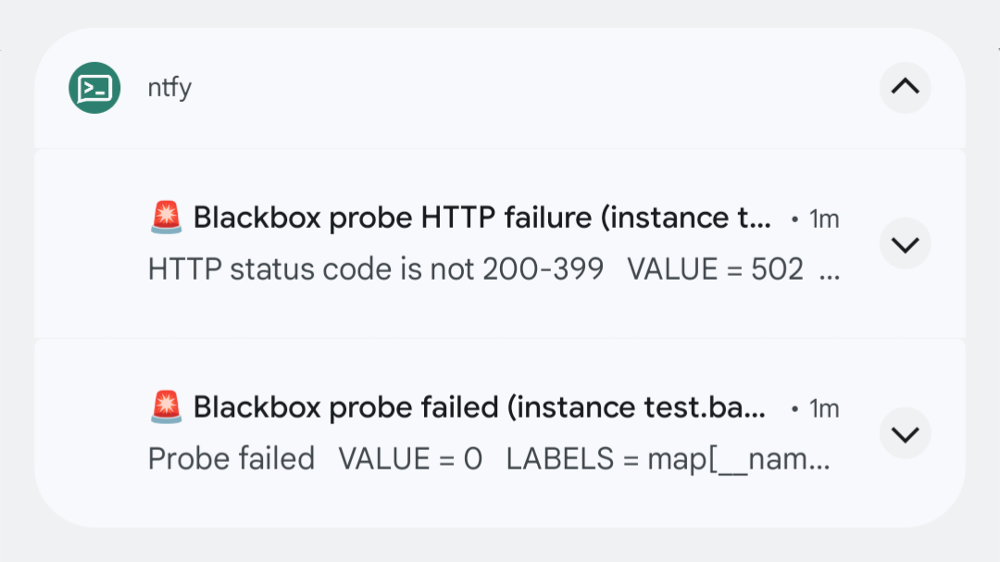

# alertmanager-ntfy [](https://github.com/alexbakker/alertmanager-ntfy/actions/workflows/build.yml)

__alertmanager-ntfy__ is a service that forwards [Prometheus
Alertmanager](https://prometheus.io/docs/alerting/latest/alertmanager/)
notifications to [ntfy.sh](https://ntfy.sh/). It is highly customizable,
allowing you to dynamically configure the ntfy notification based on the
properties of the alert that is being handled.

Example of receiving a [Blackbox
exporter](https://github.com/prometheus/blackbox_exporter) notifcation on an
Android device:



## Installation

There are a couple of ways to install alertmanager-ntfy:

- ``go install github.com/alexbakker/alertmanager-ntfy/cmd/alertmanager-ntfy``
- [Container image](https://github.com/alexbakker/alertmanager-ntfy/pkgs/container/alertmanager-ntfy)
- [Helm chart (unofficial)](https://artifacthub.io/packages/helm/djjudas21/alertmanager-ntfy)
- [NixOS module](https://nixos.org/manual/nixos/stable/options#opt-services.prometheus.alertmanager-ntfy.enable)

## Configuration

The primary way to configure the service is through a YAML configuration file.
An example configuration is availabe in [config.example.yml](config.example.yml).

Some of the ntfy notification options also accept a
[gval](https://github.com/PaesslerAG/gval) expression, rather than just a
hardcoded value. This allows you to dynamically decide the value of certain
notification properties based on the alert that the service is currently
handling. For example, if an alert is resolved, you may want to show a different
icon than when an alert is currently firing.

The title and description of the notification can be customized using [Go's
templating engine](https://pkg.go.dev/text/template). Refer to the definition of
the ``Alert`` struct in [format.go](internal/alertmanager/format.go) for the
data structure that is passed to the templates.

```yaml
http:
  addr: :8000
  auth:
    username: "alertmanager"
    password: "verysecure"
ntfy:
  baseurl: https://ntfy.sh
  updateExistingNotification: true
  # Only takes affect if updateExistingNotification is `true`
  clearResolvedNotification: true
  # Whether to delete the notification once the alert is resolved.
  # This is mutually exclusive with clearResolvedNotification.
  deleteResolvedNotification: false
  # The delay before clearing a resolved notification.
  # Must be between 10s and 24h.
  clearDelay: 10s
  auth:
    basic:
      username: "admin"
      password: "verysecure"
    # OR
    token: "verysecureauthtoken"
  notification:
    # The topic can either be a hardcoded string or a gval expression that evaluates to a string
    topic: alertmanager
    # true to send all labels as tags, false to only send labels that are explicitly defined in the tags section
    convertLabelsToTags: true
    # Priority reference: https://docs.ntfy.sh/publish/#message-priority
    # Can either be a hardcoded string or a gval expression that evaluates to a string
    priority: |
      status == "firing" ? "urgent" : "default"
    tags:
      # Tags with no condition are always included
      # Emoji shortcode reference: https://docs.ntfy.sh/emojis/
      - tag: "+1"
        condition: status == "resolved"
      - tag: rotating_light
        condition: status == "firing"
    templates:
      title: |
        {{ if eq .Status "resolved" }}Resolved: {{ end }}{{ index .Annotations "summary" }}
      description: |
        {{ index .Annotations "description" }}
      # Add ntfy actions https://docs.ntfy.sh/publish/?h=action#open-websiteapp
      actions: 
        - action: "view"
          label: "Dashboard"
          url: "{{ .GeneratorURL }}"
          condition: 'GeneratorURL != ""'
        - action: "view"
          label: "Runbook"
          url: '{{ index .Annotations "runbook_url" }}'
          condition: 'status == "firing" &&  annotations["runbook_url"] != ""' 
      headers:
        X-Click: |
          {{ .GeneratorURL }}
  # Whether to forward alerts asynchronously. When enabled, a 202 status code is
  # returned immediately. When disabled, forwarding errors result in a 5xx status
  # code.
  async: false
```

There are a couple of command line options as well that can be used to override
settings in the config file.

### Multiple configuration files

It is possible to split the configuration into multiple files. This allows you
to to keep a separate encrypted file for all of the sensitive credential
settings, while keeping the main configuration file in plain text. Simply pass a
comma-separated list of filenames:

```
alertmanager-ntfy --configs config.yml,auth.yml
```

The configuration files will be merged automatically in-memory on startup of the
service.

Example of a separate auth.yaml file:

```yaml
http:
  auth:
    username: "alertmanager"
    password: "verysecure"
ntfy:
  auth:
    basic:
      username: "admin"
      password: "verysecure"
```

## Alertmanager

Assuming you've already set up Alertmanager for your Prometheus deployment,
configuring it to send notifications to __alertmanager-ntfy__ is fairly
straightforward. Add a ``webhook_configs`` section to the receiver in your
Alertmanager configuration file:

```yaml
webhook_configs:
- url: http://127.0.0.1:8000/hook
  http_config:
    basic_auth:
      username: alertmanager
      password: verysecure
```

Replace the URL and username/password with values appropriate for your
environment.

For a full overview of the available configuration options, refer to the
[Prometheus Alertmanager
documentation](https://prometheus.io/docs/alerting/latest/configuration).

## NixOS

This repository comes with a NixOS module. To use it, simply add this repository
as an input to your Nix flake and import the module into your NixOS
configuration.

To replicate the configuration example above:

```nix
{
  services.alertmanager-ntfy = {
    enable = true;
    settings = {
      http = {
        addr = "127.0.0.1:8000";
      };
      ntfy = {
        baseurl = "https://ntfy.sh";
        notification = {
          topic = "alertmanager";
          priority = ''
            status == "firing" ? "high" : "default"
          '';
          tags = [
            {
              tag = "+1";
              condition = ''status == "resolved"'';
            }
            {
              tag = "rotating_light";
              condition = ''status == "firing"'';
            }
          ];
          templates = {
            title = ''{{ if eq .Status "resolved" }}Resolved: {{ end }}{{ index .Annotations "summary" }}'';
            description = ''{{ index .Annotations "description" }}'';
          };
        };
      };
    };
    extraSettingsPath = "/path/to/your/auth.yml";
  };
}
```

Nixpkgs also has a module for alertmanager-ntfy: https://nixos.org/manual/nixos/stable/options#opt-services.prometheus.alertmanager-ntfy.enable
